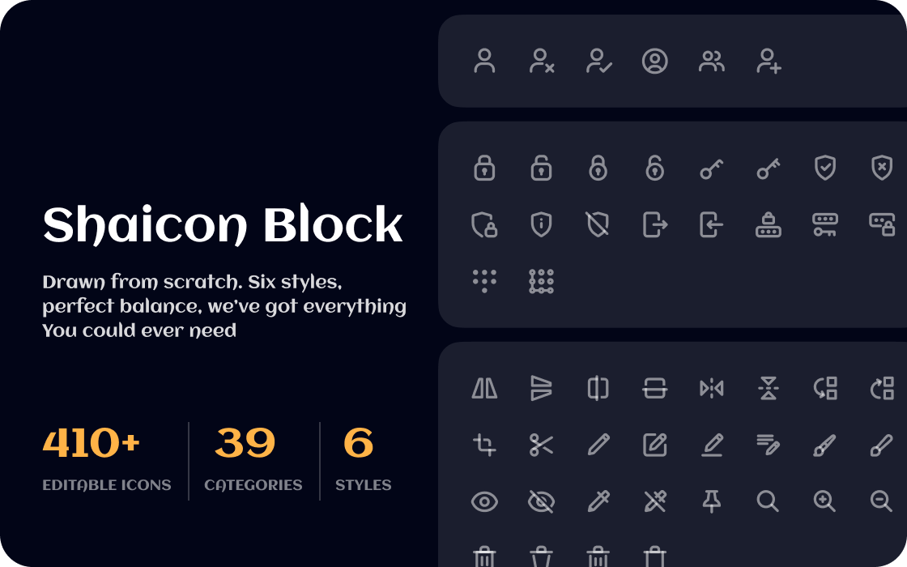

# Shaicon Block Plugin for WordPress



The Shaicon Block plugin simplifies the process of adding custom SVG icons and graphics to the WordPress block editor (Gutenberg).

### It offers the following key features:

- **290+ Native WordPress Icons:** Access a library of native WordPress icons, including social logos.
- **120+ Solar Icons:** To enhance your WordPress project, leverage the Solar Icon library for additional icons and graphics.
- **Custom SVG Support:** Use your own custom SVG icons or graphics.
- **Icon Controls:** Enjoy convenient controls for linking, rotating, aligning, adjusting colors, borders, padding, and margins.
- **Site Editor Compatibility:** The plugin works seamlessly with the Site Editor.
- **No Additional Block Library Required:** Built using native WordPress components.
- **Future-Proof:** As WordPress core evolves, the plugin will receive additional functionality.
- **Custom Icon Libraries:** Register your own custom icon library.

## Extensibility

Shaicon Block includes several extensibility features that allow you to tailor the block to meet your needs.

### Hooks & Filters

#### `iconBlock.icons`
#### `iconBlock.enableCustomIcons`

Defaults to `true`, this filter allows you to enable or disable custom SVG icon functionality. When disabled, you are restricted from using the icon library.

```jsx
wp.hooks.addFilter(
	'iconBlock.enableCustomIcons',
	'example-theme/disable-custom-icons',
	() => false
);
```

## Requirements

- WordPress 6.4+
- PHP 7.4+

## Development

1. Set up a local WordPress development environment.
2. Clone / download this repository into the `wp-content/plugins` folder.
3. Navigate to the `wp-content/plugins/shaicon-block` folder in the command line.
4. Run `npm install` to install the plugin's dependencies within a `/node_modules/` folder.
5. Run `npm run start` to compile and watch source files for changes while developing.

Refer to `package.json` for additional commands.
